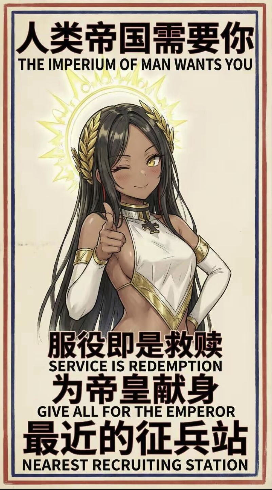
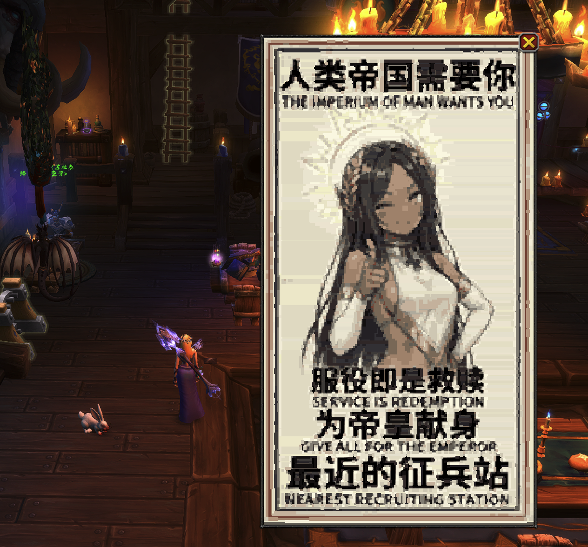

# trp-img-creator

Display images inside **World of Warcraft** using [TRP3: Extended](https://www.curseforge.com/wow/addons/total-rp-3-extended) item scripts — no addon required for viewers.

Images are encoded into compact base62 run-length data by a Python script, then rendered in-game as colored WoW frame textures.

| Source image | In-game result |
|:---:|:---:|
|  |  |

---

## How it works

```
your_image.png  →  convert-img.py  →  your_image_loader2.lua  +  draw-img.lua
                                         ↓                          ↓
                                  (loader script)           (draw script)
                                  sets globals              reads globals & renders
```

1. `convert-img.py` quantizes the PNG to a small palette, merges similar-colored horizontal runs, and encodes everything as a base62 string.
2. The generated `_loader2.lua` script stores the canvas size, palette, and pixel data as WoW globals.
3. `draw-img.lua` reads those globals and draws colored `CreateTexture` rectangles to reconstruct the image.

Both scripts are pasted into separate TRP3 Extended item scripts and run in sequence.

---

## Requirements

- Python 3.8+
- [Pillow](https://pillow.readthedocs.io/) (`pip install Pillow`)
- World of Warcraft with the [TRP3: Extended](https://www.curseforge.com/wow/addons/total-rp-3-extended) addon

---

## Usage

### 1. Encode your image

Drop any `.png` file into the `trpImgCreater/` folder alongside `convert-img.py`, then run:

```bash
python convert-img.py
```

This generates `your_image_loader2.lua` in the same folder.

### 2. Configure per-image settings (optional)

Edit the `IMAGE_CONFIG` dict at the top of `convert-img.py`:

```python
IMAGE_CONFIG = {
    "your_image": {"H": 220, "MERGE_TOL": 30, "PALETTE_SIZE": 64},
}
```

| Key | Description |
|-----|-------------|
| `W` | Pin canvas width in pixels (height auto-calculated) |
| `H` | Pin canvas height in pixels (width auto-calculated) |
| `MERGE_TOL` | Manhattan color distance for merging adjacent runs — higher = fewer segments, lower quality |
| `PALETTE_SIZE` | Number of palette colors: `32` or `64` |

Specify either `W` **or** `H`, not both. Omit entirely to use the defaults at the top of the file.

### 3. Set up TRP3 Extended scripts

In-game, create a TRP3 Extended **item** with two **Script** actions:

**Script 1 — Loader** (run first):
- Paste the full contents of `your_image_loader2.lua`

**Script 2 — Draw** (run second, or combine into one button):
- Paste the full contents of `draw-img.lua`

Trigger both scripts in order (e.g. via a single button that runs Script 1 then Script 2). The image appears in a draggable, closable window centered on screen.

---

## Tuning guide

WoW has a texture limit of roughly **12,000–15,000** textures per frame. If your image exceeds this, the draw will stop mid-image.

Check the output of `convert-img.py`:

```
OK portrait.png | 122x220 (pinned H=220) | tol=30 | 8,412 runs | 41.0 KB
   verified | max safe H for W=122/PALSZ=64: 963px
```

If you see a `WARNING: X segs may exceed WoW texture limit` message, fix it by:

- Raising `MERGE_TOL` (e.g. `30` → `50`) — biggest impact
- Lowering `H` or `W` to reduce total pixels
- Lowering `PALETTE_SIZE` to `32` for images with large flat areas or text

### Rule of thumb

| Image type | Suggested MERGE_TOL |
|------------|-------------------|
| Text / flat colors | 10–20 |
| Portraits / illustrations | 25–40 |
| Complex paintings | 50–70 |

---

## Notes

- Images with transparency are supported — fully transparent pixels are skipped.
- The canvas auto-scales to fit the screen height with a safe margin for action bars.
- The frame is draggable and has a close button (×).
- Do **not** wrap draw calls in `pcall` — WoW's sandbox causes `CreateTexture` to return nil inside protected calls.

---

## Author

**安灼 - 金色平原**

## License

MIT
